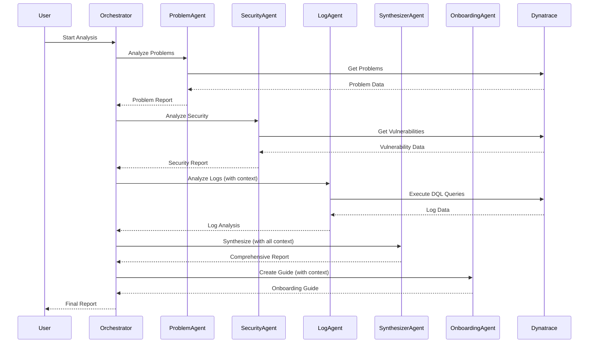

# System Architecture - Dynatrace Observability Multi-Agent System

## 🏛️ Architectural Overview

This document provides a deep dive into the architectural design, agent interactions, and technical implementation of the multi-agent system.

## 🎯 Design Principles

### 1. Hierarchical Organization
- **Specialist Agents**: Domain experts with focused responsibilities
- **Master Agent**: Orchestrates and synthesizes findings
- **Sequential Workflow**: Ensures proper context flow between agents

### 2. Separation of Concerns
- Each agent has a single, well-defined responsibility
- Tools are modular and reusable
- Clear boundaries between data collection and analysis

### 3. Context Propagation
- Agents build on previous findings
- Context flows from specialists to synthesizer
- No redundant data collection

## 🔄 Agent Workflow



## 🤖 Agent Specifications

### 1. Problem Analyst Agent

**Role:** Problem Analyst  
**Expertise:** Incident management, problem analysis, SRE practices

**Capabilities:**
- Retrieves open problems from Dynatrace
- Analyzes problem severity and impact
- Identifies root causes
- Assesses affected entities
- Prioritizes issues by business impact

**Tools:**
- `GetProblemsTool`: Fetches problems for a time range
- `GetProblemDetailsTool`: Gets detailed problem information

**Output:**
- Structured problem report
- Severity assessment
- Priority recommendations

**LLM Configuration:**
- Temperature: 0.3 (precise, factual)
- Max iterations: 10

---

### 2. Security Analyst Agent

**Role:** Security Analyst  
**Expertise:** Vulnerability management, CVE analysis, risk assessment

**Capabilities:**
- Identifies security vulnerabilities
- Assesses risk levels
- Tracks CVE information
- Identifies affected components
- Provides remediation guidance

**Tools:**
- `GetSecurityProblemsTool`: Fetches security problems and vulnerabilities

**Output:**
- Security assessment report
- Risk-prioritized vulnerability list
- Remediation recommendations

**LLM Configuration:**
- Temperature: 0.3 (precise, security-focused)
- Max iterations: 10

---

### 3. Log Analyst Agent

**Role:** Log Analyst  
**Expertise:** Log analysis, pattern recognition, debugging

**Capabilities:**
- Analyzes error logs
- Identifies patterns and anomalies
- Correlates logs with problems
- Extracts meaningful insights
- Supports root cause analysis

**Tools:**
- `ExecuteDQLTool`: Executes custom DQL queries
- `GetLogsForEntityTool`: Retrieves logs for specific entities

**Context Dependencies:**
- Receives problem report from Problem Analyst
- Receives security report from Security Analyst
- Uses context to focus log analysis

**Output:**
- Log analysis report
- Error patterns
- Correlation insights

**LLM Configuration:**
- Temperature: 0.4 (balanced creativity and precision)
- Max iterations: 10

---

### 4. Insights Synthesizer Agent

**Role:** Observability Insights Synthesizer  
**Expertise:** Technical consulting, observability, synthesis

**Capabilities:**
- Synthesizes findings from all specialists
- Creates comprehensive reports
- Correlates data across sources
- Provides actionable recommendations
- Prioritizes issues

**Tools:**
- None (synthesizes existing data)

**Context Dependencies:**
- Receives all specialist reports
- Builds on complete analysis

**Output:**
- Executive summary
- Comprehensive issue analysis
- Prioritized recommendations
- Actionable mitigation steps

**LLM Configuration:**
- Temperature: 0.6 (creative synthesis)
- Max iterations: 15

---

### 5. Onboarding Guide Agent

**Role:** Dynatrace Onboarding Guide  
**Expertise:** Education, Dynatrace platform, best practices

**Capabilities:**
- Explains Dynatrace capabilities
- Educates on data types
- Provides practical examples
- Shares best practices
- Guides next steps

**Tools:**
- None (educational content)

**Context Dependencies:**
- Receives synthesized report
- Uses real examples from analysis

**Output:**
- Onboarding guide
- Best practices
- Practical examples
- Next steps

**LLM Configuration:**
- Temperature: 0.7 (educational, engaging)
- Max iterations: 10

## 🛠️ Tool Architecture

### Base Tool Structure

All tools inherit from `BaseTool` (CrewAI):

```python
class CustomTool(BaseTool):
    name: str = "Tool Name"
    description: str = "What the tool does"
    
    def _run(self, input: str) -> str:
        # Implementation
        pass
```

### Dynatrace Client

Centralized client for API interactions:

```python
class DynatraceClient:
    - execute_dql(query: str) -> Dict
    - get_problems(time_from: str, time_to: str) -> Dict
    - get_problem_details(problem_id: str) -> Dict
    - get_security_problems(time_from: str) -> Dict
    - get_entity_details(entity_id: str) -> Dict
```

**Features:**
- Centralized authentication
- Error handling
- Timeout management
- Response formatting

### Tool Catalog

| Tool | Purpose | Input | Output |
|------|---------|-------|--------|
| GetProblemsTool | Fetch problems | Time range | Problem list |
| GetProblemDetailsTool | Problem details | Problem ID | Detailed info |
| GetSecurityProblemsTool | Fetch vulnerabilities | Time range | Vulnerability list |
| ExecuteDQLTool | Custom queries | DQL query | Query results |
| GetLogsForEntityTool | Entity logs | Entity ID | Log entries |

## 📊 Data Flow

### 1. Data Collection Phase

```
User Request
    ↓
Orchestrator
    ↓
┌─────────────────────────────────┐
│  Parallel Data Collection       │
│  (Independent Agents)            │
├─────────────────────────────────┤
│  Problem Agent → Problems        │
│  Security Agent → Vulnerabilities│
└─────────────────────────────────┘
    ↓
Context Storage
```

### 2. Correlation Phase

```
Context Storage
    ↓
Log Agent (with context)
    ↓
Correlates logs with:
  - Problems
  - Vulnerabilities
  - Affected entities
    ↓
Enhanced Context
```

### 3. Synthesis Phase

```
Enhanced Context
    ↓
Synthesizer Agent
    ↓
Creates:
  - Executive summary
  - Prioritized issues
  - Recommendations
    ↓
Comprehensive Report
```

### 4. Education Phase

```
Comprehensive Report
    ↓
Onboarding Agent
    ↓
Creates:
  - Capability overview
  - Practical examples
  - Best practices
    ↓
Final Deliverable
```

## 🔐 Security Considerations

### 1. Credential Management
- Environment variables for sensitive data
- No hardcoded credentials
- `.env` file excluded from version control

### 2. API Token Scopes
- Principle of least privilege
- Read-only access where possible
- Scoped to necessary data types

### 3. Data Handling
- No persistent storage of sensitive data
- Reports contain only necessary information
- JSON output for audit trails

## 💰 Cost Optimization

### Dynatrace Grail Costs

**Budget Tracking:**
- Default budget: 1000 GB per session
- Configurable via `DT_GRAIL_QUERY_BUDGET_GB`
- Warnings at 80% usage

**Query Optimization:**
- Time-bounded queries
- Limit result sets
- Use specific filters
- Leverage buckets

**Example Cost Calculation:**
```
Typical Analysis:
- Problems query: ~0.1 GB
- Security query: ~0.2 GB
- Log queries: ~1-5 GB (depends on volume)
- Total: ~1-5 GB per analysis

At $0.0035/GB (example rate):
Cost per analysis: $0.0035 - $0.0175
```

### OpenAI Costs

**Token Usage:**
- Input tokens: ~5,000-15,000 per agent
- Output tokens: ~2,000-10,000 per agent
- Total per analysis: ~10,000-50,000 tokens

**Cost Calculation (GPT-4o-mini):**
```
Input: $0.15 per 1M tokens
Output: $0.60 per 1M tokens

Typical analysis:
- Input: 15,000 tokens = $0.00225
- Output: 10,000 tokens = $0.006
- Total: ~$0.01 per analysis
```

## 🚀 Performance Characteristics

### Execution Time

**Typical Analysis:**
- Agent initialization: 5-10 seconds
- Problem analysis: 10-20 seconds
- Security analysis: 10-20 seconds
- Log analysis: 20-40 seconds
- Synthesis: 30-60 seconds
- Onboarding guide: 20-30 seconds
- **Total: 2-4 minutes**

**Factors Affecting Performance:**
- Number of problems/vulnerabilities
- Log volume
- Network latency
- LLM response time

### Scalability

**Current Limits:**
- Problems: 50 per query
- Security issues: 50 per query
- Logs: 50 per query
- Can be adjusted in tool implementations

**Scaling Strategies:**
- Pagination for large datasets
- Parallel agent execution (future)
- Caching for repeated queries
- Incremental analysis

## 🔄 Extension Points

### Adding New Agents

1. Create agent in `specialist_agents.py`
2. Define task in `tasks.py`
3. Add to crew in `crew_orchestrator.py`
4. Update workflow sequence

### Adding New Tools

1. Create tool class in `dynatrace_mcp_tools.py`
2. Implement `_run()` method
3. Add to relevant agent's tool list
4. Document in README

### Custom Workflows

1. Modify task descriptions
2. Adjust context dependencies
3. Change process type (sequential/hierarchical)
4. Add conditional logic

## 📈 Monitoring and Observability

### System Metrics

**Tracked Automatically:**
- Execution duration
- Agent iterations
- Task completion status
- Error occurrences

**Available in Reports:**
- Timestamp
- Duration
- Agent count
- Task count
- Success/failure status

### Logging

**Console Output:**
- Rich formatting
- Progress indicators
- Status updates
- Error messages

**File Output:**
- Markdown reports
- JSON data
- Structured metadata

## 🧪 Testing Strategy

### Unit Testing
- Test individual tools
- Mock Dynatrace API responses
- Validate data transformations

### Integration Testing
- Test agent interactions
- Validate context flow
- Check report generation

### End-to-End Testing
- Full workflow execution
- Real Dynatrace environment
- Validate final output

## 🔮 Future Enhancements

### Potential Improvements

1. **Parallel Agent Execution**
   - Run independent agents concurrently
   - Reduce total execution time

2. **Caching Layer**
   - Cache Dynatrace responses
   - Reduce API calls and costs

3. **Interactive Mode**
   - Allow user to guide analysis
   - Ask follow-up questions

4. **Automated Actions**
   - Create Dynatrace workflows
   - Send notifications
   - Update tickets

5. **Historical Analysis**
   - Track trends over time
   - Compare with previous analyses
   - Identify patterns

6. **Custom Reporting**
   - HTML reports
   - PDF generation
   - Dashboard integration

---

**This architecture provides a solid foundation for comprehensive observability analysis while remaining flexible and extensible.**
