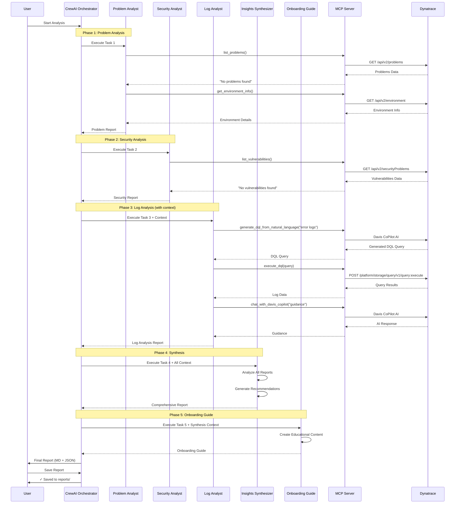
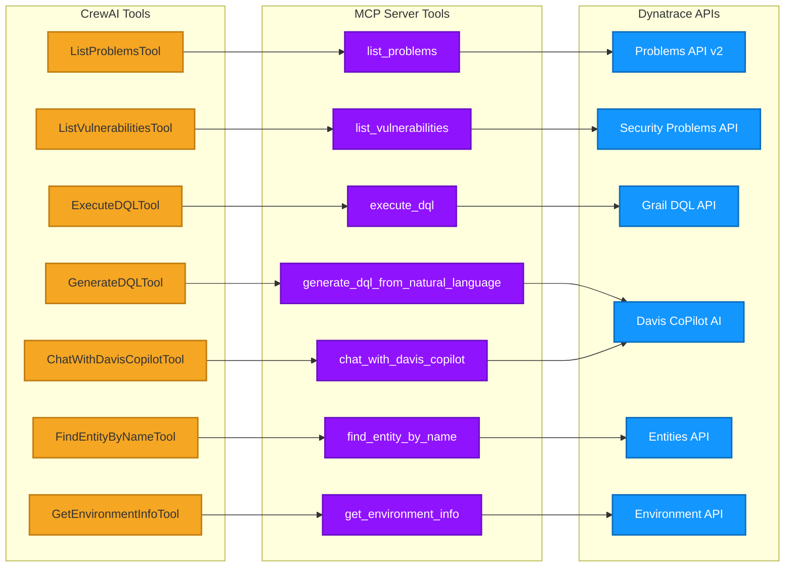

# Dynatrace Multi-Agent System Workflow

## Complete System Architecture with Tools and Tasks

```mermaid
graph TB
    Start([User Initiates Analysis]) --> Crew[CrewAI Orchestrator]
    
    Crew --> Agent1[Problem Analyst Agent]
    Crew --> Agent2[Security Analyst Agent]
    Crew --> Agent3[Log Analyst Agent]
    Crew --> Agent4[Insights Synthesizer Agent]
    Crew --> Agent5[Onboarding Guide Agent]
    
    %% Problem Analyst Flow
    Agent1 --> Task1[Task 1: Problem Analysis<br/>Analyze last 24h problems]
    Task1 --> Tool1A[List Dynatrace Problems]
    Task1 --> Tool1B[Find Entity by Name]
    Task1 --> Tool1C[Get Environment Info]
    
    Tool1A --> MCP1[MCP Server:<br/>list_problems]
    Tool1B --> MCP2[MCP Server:<br/>find_entity_by_name]
    Tool1C --> MCP3[MCP Server:<br/>get_environment_info]
    
    MCP1 --> DT1[Dynatrace API:<br/>Problems v2]
    MCP2 --> DT2[Dynatrace API:<br/>Entities]
    MCP3 --> DT3[Dynatrace API:<br/>Environment]
    
    DT1 --> Result1[Problem Report:<br/>- Problem IDs<br/>- Severity<br/>- Affected Entities]
    DT2 --> Result1
    DT3 --> Result1
    
    %% Security Analyst Flow
    Agent2 --> Task2[Task 2: Security Analysis<br/>Analyze last 7d vulnerabilities]
    Task2 --> Tool2A[List Dynatrace Vulnerabilities]
    Task2 --> Tool2B[Find Entity by Name]
    
    Tool2A --> MCP4[MCP Server:<br/>list_vulnerabilities]
    Tool2B --> MCP2
    
    MCP4 --> DT4[Dynatrace API:<br/>Security Problems]
    
    DT4 --> Result2[Security Report:<br/>- CVE IDs<br/>- Risk Levels<br/>- Affected Components]
    
    %% Log Analyst Flow
    Agent3 --> Task3[Task 3: Log Analysis<br/>Analyze logs with context]
    Task3 -.Context.-> Result1
    Task3 -.Context.-> Result2
    
    Task3 --> Tool3A[Execute DQL Query]
    Task3 --> Tool3B[Generate DQL from NL]
    Task3 --> Tool3C[Find Entity by Name]
    Task3 --> Tool3D[Chat with Davis CoPilot]
    
    Tool3A --> MCP5[MCP Server:<br/>execute_dql]
    Tool3B --> MCP6[MCP Server:<br/>generate_dql_from_nl]
    Tool3C --> MCP2
    Tool3D --> MCP7[MCP Server:<br/>chat_with_davis_copilot]
    
    MCP5 --> DT5[Dynatrace Grail:<br/>DQL Execution]
    MCP6 --> DT6[Davis CoPilot AI:<br/>DQL Generation]
    MCP7 --> DT7[Davis CoPilot AI:<br/>Chat Interface]
    
    DT5 --> Result3[Log Analysis Report:<br/>- Error Patterns<br/>- Log Correlations<br/>- Key Messages]
    DT6 --> Result3
    DT7 --> Result3
    
    %% Synthesizer Flow
    Agent4 --> Task4[Task 4: Synthesis<br/>Combine all findings]
    Task4 -.Context.-> Result1
    Task4 -.Context.-> Result2
    Task4 -.Context.-> Result3
    
    Task4 --> Result4[Comprehensive Report:<br/>- Executive Summary<br/>- Critical Issues<br/>- Recommendations<br/>- Mitigation Steps]
    
    %% Onboarding Guide Flow
    Agent5 --> Task5[Task 5: Onboarding Guide<br/>Create educational content]
    Task5 -.Context.-> Result4
    
    Task5 --> Result5[Onboarding Guide:<br/>- Dynatrace Capabilities<br/>- Best Practices<br/>- Next Steps<br/>- Real Examples]
    
    %% Final Output
    Result5 --> Output[Final Report:<br/>Markdown + JSON]
    Output --> Save[Save to reports/<br/>observability_report_*.md/json]
    
    %% Styling
    classDef agentClass fill:#4A90E2,stroke:#2E5C8A,stroke-width:2px,color:#fff
    classDef taskClass fill:#50C878,stroke:#2E7D4E,stroke-width:2px,color:#fff
    classDef toolClass fill:#F5A623,stroke:#C17D11,stroke-width:2px,color:#fff
    classDef mcpClass fill:#9013FE,stroke:#6B0FC7,stroke-width:2px,color:#fff
    classDef dtClass fill:#1496FF,stroke:#0D6EBD,stroke-width:2px,color:#fff
    classDef resultClass fill:#7ED321,stroke:#5A9B18,stroke-width:2px,color:#fff
    
    class Agent1,Agent2,Agent3,Agent4,Agent5 agentClass
    class Task1,Task2,Task3,Task4,Task5 taskClass
    class Tool1A,Tool1B,Tool1C,Tool2A,Tool2B,Tool3A,Tool3B,Tool3C,Tool3D toolClass
    class MCP1,MCP2,MCP3,MCP4,MCP5,MCP6,MCP7 mcpClass
    class DT1,DT2,DT3,DT4,DT5,DT6,DT7 dtClass
    class Result1,Result2,Result3,Result4,Result5,Output resultClass
```



## Sequential Workflow



## Tool-to-MCP-to-API Mapping



## Agent Responsibilities Matrix

| Agent | Role | Tools Used | Output |
|-------|------|------------|--------|
| **Problem Analyst** | Identify system issues | • ListProblemsTool<br>• FindEntityByNameTool<br>• GetEnvironmentInfoTool | Problem Report with severity, impact, affected entities |
| **Security Analyst** | Identify vulnerabilities | • ListVulnerabilitiesTool<br>• FindEntityByNameTool | Security Report with CVEs, risk levels, affected components |
| **Log Analyst** | Analyze logs & correlate | • ExecuteDQLTool<br>• GenerateDQLTool<br>• FindEntityByNameTool<br>• ChatWithDavisCopilotTool | Log Analysis with error patterns, correlations, key messages |
| **Insights Synthesizer** | Combine findings | None (uses context) | Comprehensive Report with recommendations and mitigation steps |
| **Onboarding Guide** | Create educational content | None (uses context) | Onboarding Guide with best practices and next steps |

## Data Flow Summary

```
User Request
    ↓
CrewAI Orchestrator
    ↓
┌─────────────────────────────────────────────────────────┐
│ Phase 1: Problem Analyst                                │
│   Tools: ListProblems, FindEntity, GetEnvInfo           │
│   Output: Problem Report                                │
└─────────────────────────────────────────────────────────┘
    ↓
┌─────────────────────────────────────────────────────────┐
│ Phase 2: Security Analyst                               │
│   Tools: ListVulnerabilities, FindEntity                │
│   Output: Security Report                               │
└─────────────────────────────────────────────────────────┘
    ↓
┌─────────────────────────────────────────────────────────┐
│ Phase 3: Log Analyst (receives context from above)      │
│   Tools: ExecuteDQL, GenerateDQL, FindEntity, ChatDavis │
│   Output: Log Analysis Report                           │
└─────────────────────────────────────────────────────────┘
    ↓
┌─────────────────────────────────────────────────────────┐
│ Phase 4: Insights Synthesizer (receives all context)    │
│   Tools: None                                           │
│   Output: Comprehensive Report + Recommendations        │
└─────────────────────────────────────────────────────────┘
    ↓
┌─────────────────────────────────────────────────────────┐
│ Phase 5: Onboarding Guide (receives synthesis)          │
│   Tools: None                                           │
│   Output: Educational Guide + Best Practices            │
└─────────────────────────────────────────────────────────┘
    ↓
Final Report (Markdown + JSON)
    ↓
Saved to reports/
```

## Legend

- 🔵 **Agents**: AI agents with specific expertise
- 🟢 **Tasks**: Specific assignments with goals and expected outputs
- 🟠 **Tools**: Python wrappers for MCP server calls
- 🟣 **MCP Server**: Official Dynatrace MCP server (Node.js)
- 🔷 **Dynatrace APIs**: Backend REST APIs and AI services
- 🟩 **Results**: Structured outputs passed between agents

## Key Features

1. **Hierarchical Architecture**: Specialist agents → Master synthesizer
2. **Context Propagation**: Each agent receives context from previous agents
3. **MCP Integration**: All tools use official Dynatrace MCP Server
4. **AI-Powered**: Leverages Davis CoPilot for DQL generation and guidance
5. **Sequential Workflow**: Ensures proper data flow and context building
6. **Comprehensive Output**: Markdown report + JSON data for automation
